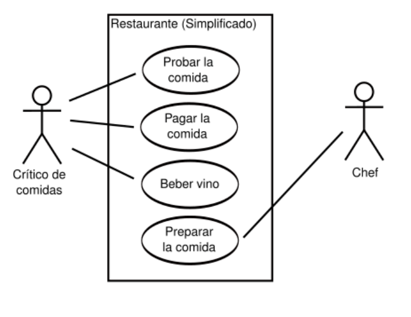

# ANALISE DE DADOS E PADRÕES DE PROJETO

# IMPORTANTE: COMO VAI SER A PROVA!!!!!!
1. Vai ser dado um [cenário] um pouco maior que o cenário da aula do dia [29/05].
2. Começar trabalhando requisitos [funcionais](#requisitos) e [não] funcionais do sistema.
3. Depois, fazer um [diagrama de caso de uso](#diagrama-de-caso-de-uso) para representar os requisitos.
    - Não precisa desenhar o diagrama de caso de uso, apenas descrever os requisitos.
4. Em seguida, fazer um [diagrama de classes](#diagrama-de-classes) para representar a estrutura do sistema.
    - O diagrama de classes o professor quer DESCRITO

5. O professor não quer algo muito detalhado, mas quer que os conceitos estejam claros e diretos.

## O que são requisitos?
Requisitos em um projeto de sofware sao descrições detalhadas das funcionalidades e restrições que um sistema deve atender para satisfazer as necessidades do cliente. Eles são a base para a definição do escopo do projeto e servem como guia para o desenvolvimento do software.

## Levantamento de requisitos
É o ponto de partida para compreender as expectativas e requsitos dos [stakeholders](#stakeholders) e definir o escopo do projeto. O levantamento de requisitos é uma atividade crítica para o sucesso do projeto, pois é a partir dele que se define o que será feito e como será feito.

### Técnicas de levantamento de requisitos
- **Entrevistas**: Conversas com os stakeholders para entender suas necessidades.
- **Questionários**: Formulários com perguntas para os stakeholders.
- **Observação**: Observar o ambiente de trabalho dos stakeholders.
- **Prototipação**: Criar protótipos para validar as ideias com os stakeholders.
- **Workshops**: Reuniões com os stakeholders para discutir os requisitos.

### Etapas do levantamento de requisitos
1. **Identificação dos stakeholders**: Identificar as pessoas que serão impactadas pelo sistema.
2. **Entendimento do negócio**: Compreender o negócio e as necessidades dos stakeholders.
3. **Definição do escopo**: Definir o que será feito e o que não será feito no projeto.
4. **Especificação dos requisitos**: Documentar os requisitos de forma clara e objetiva.
5. **Validação dos requisitos**: Validar os requisitos com os stakeholders para garantir que estão corretos e completos.

### Representação de requisitos
Eu, como [usuário], desejo [funcionalidade] para que [objetivo], por que [motivo], exemplo: Eu, como [usuário], desejo [poder salvar um arquivo] para que [eu possa acessá-lo posteriormente], por que [eu preciso armazenar informações importantes].

### Tipos de requisitos
- **Requisitos de usuário**: Descrevem o que o usuário espera do sistema, ex: "O sistema deve permitir que o usuário faça login".
- **Requisitos de sistema**: Descrevem o que o sistema deve fazer, ex: "O sistema deve armazenar os dados do usuário".

- **Requisitos Funcionais**: Descrevem o que o sistema deve fazer, ex: "O sistema deve permitir que o usuário faça login".
- **Requisitos Não Funcionais**: Descrevem como o sistema deve ser, ex: "O sistema deve ser rápido".
- **Requisitos de Domínio**: Descrevem restrições impostas pelo ambiente em que o sistema será executado.

### Processo de desenvolvimento de software
1. Levantar requisitos
2. Analisar requisitos
3. Especificar o sistema
4. Implementar o sistema e testar
5. Manter o sistema

## Diagramas 

### Diagrama de Caso de Uso
O diagrama de caso de uso é uma representação gráfica dos requisitos do sistema, mostrando as interações entre os atores e o sistema
Um documento de requisitos é uma descrição detalhada das funcionalidades e restrições que um sistema deve atender para satisfazer as necessidades do cliente.

Podemos desenhar um diagrama de caso de uso para representar os requisitos do sistema, mostrando as interações entre os atores e o sistema.

#### Passos para criar um diagrama de caso de uso
1. Identificar os atores do sistema.
2. Identificar os casos de uso do sistema.
3. Descrever os casos de uso.
4. Identificar as relações entre os atores e os casos de uso.
5. Desenhar o diagrama de caso de uso.

### Diagrama de Classes
O diagrama de classes é uma representação gráfica da estrutura do sistema, mostrando as classes, atributos e métodos do sistema, bem como as relações entre elas.

### Diagrama de Sequência
O diagrama de sequência é uma representação gráfica da interação entre os objetos do sistema, mostrando a ordem em que as mensagens são trocadas entre eles.

## Tamanho, duração e custo de um projeto

O processo de gerenciamento de projetos de software é muito importante, para garantir a qualidade na prestação de serviço.

Essas informações são essenciais para:
1. Planejar adequadamente os recursos necessários.
2. Definir prazos realistas.
3. Corresponder as expectativas dos clientes(ou stakeholders).

## Estimativa de tamanho
A estimativa de tamanho é uma das primeiras atividades a serem realizadas em um projeto de software. Ela é importante para determinar o esforço necessário para desenvolver o sistema e para definir o prazo e o custo do projeto.

### Pontos de função
Os pontos de função são uma técnica de estimativa de tamanho de software baseada nas funcionalidades que o sistema oferece aos usuários. Eles são calculados com base em cinco tipos de funções de dados e quatro

### Casos de uso
Os casos de uso são uma técnica de estimativa de tamanho de software baseada nas interações entre os usuários e o sistema. Eles são usados para identificar os requisitos do sistema e estimar o esforço necessário para desenvolver o sistema.

### Story Points
Os story points são uma técnica de estimativa de tamanho de software baseada na complexidade das histórias de usuário. Eles são usados para estimar o esforço necessário para desenvolver as funcionalidades do sistema.

### Linhas de código
As linhas de código são uma técnica de estimativa de tamanho de software baseada no número de linhas de código fonte do sistema. Elas são usadas para estimar o esforço necessário para desenvolver o sistema.

## Estimativa de duração
Envolve a precisão do tempo necessário para concluir as atividades do projeto. Deve considerar complexidade das tarefas, disponibilidade de recursos, experiência da equipe, entre outros fatores.

### Analogia
Baseia-se em projetos anteriores semelhantes para estimar a duração do projeto atual.

### Decomposição
Divide o projeto em tarefas menores e estima a duração de cada tarefa.

### PERT
Utiliza três estimativas para cada tarefa: otimista, mais provável e pessimista, para calcular a duração esperada da tarefa.

## Estimativa de custo

A estimativa de custo é uma das atividades mais importantes do gerenciamento de projetos de software, pois permite determinar o orçamento necessário para desenvolver o sistema e garantir que o projeto seja concluído dentro do prazo e do custo previstos.

### Estimativa analoga
Baseia-se em projetos anteriores semelhantes para estimar o custo do projeto atual.

### Estimativa bottom-up
Divide o projeto em tarefas menores e estima o custo de cada tarefa.

### Estimativa de três pontos
Utiliza três estimativas para cada tarefa: otimista, mais provável e pessimista, para calcular o custo esperado da tarefa.

### Estimativa de custo por ponto de função
Calcula o custo do projeto com base no número de pontos de função do sistema e no custo por ponto de função.

### Análise de custo-benefício
Avalia os custos e benefícios do projeto para determinar se ele é viável financeiramente.

## CUIDADOS

É importante reconhecer que são [apenas previões](#estimativa-de-duração) e que podem variar ao longo do projeto.

Deve-se [revisar e atualizar regularmente] as estimativas na medida que mais informações se tornam disponíveis.

Importante [envolver todas as partes interessadas] relevantes nos processos de estimativa para garantir que as expectativas sejam alinhadas e os compromissos sejam realistas.

